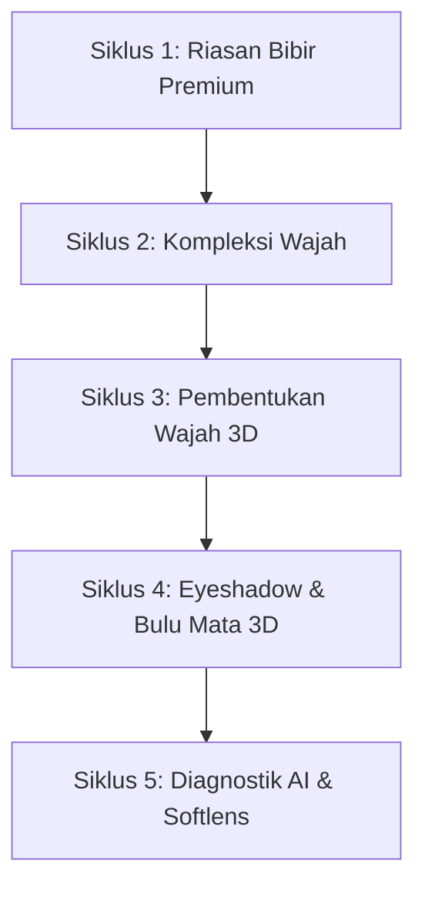

# Rencana Pengembangan Komprehensif: Penyempurnaan AR Engine & Integrasi Virtual Try-On (VTO) Hiper-Realistis

Rencana ini merinci alur kerja terstruktur untuk menyempurnakan **Fizgravity AR Engine (Rust Core)** dan mengintegrasikan fitur-fitur **VTO Kosmetik Premium** ke dalam aplikasi **GlowMatch (C++ JNI & Flutter UI)** menggunakan pendekatan *Feature-Driven Iterative Cycle* (Siklus Iteratif Berbasis Fitur).

---

## 🔒 Hal yang Perlu Ditinjau Pengguna

> [!IMPORTANT]
> **Pendekatan Siklus Iteratif Berbasis Fitur**
> *   Kita akan memprogram dan menyempurnakan fitur per-kategori makeup (dimulai dari Bibir, lalu Kompleksi Wajah, Kontur Hidung/Highlight, hingga riasan Mata).
> *   Setiap siklus selesai ditulis di Rust, kita akan langsung memperbarui JNI C++ dan merender visualnya di layar HP untuk memvalidasi presisi penempatan, stabilitas temporal (anti-jitter), dan akurasi warna.

---

## 🛠️ Rencana Kerja Bertahap (Milestone Plan)



### 💄 Siklus 1: Riasan Bibir Premium (Lipstick, Lip Gloss, Lip Liner & Ombre)
*   **Rust Engine**: 
    *   Menguji stabilitas koordinat batas bibir menggunakan One-Euro Filter.
    *   Memastikan `calculate_dynamic_ao` mengembalikan oklusi celah bibir yang halus saat mulut digerakkan.
*   **C++ JNI & Renderer (`gl_mesh_engine.cpp` & `gl_renderer.cpp`)**:
    *   Merender shader bibir terpisah (bibir atas dan bawah) dengan metode triangulasi Delaunay.
    *   Menambahkan parameter shader untuk hasil akhir: *Matte* (roughness tinggi), *Glossy* (roughness rendah, specular pantulan ring light tajam), *Metallic*, dan *Ombre (Gradasi)*.
    *   Membuat texture mask lip liner di shader.

### 👩 Siklus 2: Kompleksi Wajah (Foundation, Blush-On & Hairline Blending)
*   **Rust Engine**:
    *   Menyempurnakan `calculate_hairline_blending` dengan parameter radius fade yang adaptif terhadap skala piksel wajah.
    *   Memverifikasi ITA° skin undertone classifier bekerja klinis pada pipeline buffer gambar.
*   **C++ JNI & Renderer**:
    *   Mengimplementasikan *High-Pass Blending Shader* di OpenGL untuk foundation agar pori-pori kulit asli tidak buram.
    *   Menerapkan segmentasi semantik area pipi untuk Blush-On multi-tone.
    *   Menghubungkan McCamy lighting Kelvin temperature untuk menyeimbangkan bias warna lampu sekitar.

### 👃 Siklus 3: Pembentukan Wajah 3D (Contour, Specular Highlight & Nose Shading)
*   **Rust Engine**:
    *   Memastikan kalkulasi normal 3D vertex di `src/face.rs` mulus dan cepat.
    *   Mengekspor pergeseran giroskop real-time untuk shimmer highlight.
*   **C++ JNI & Renderer**:
    *   Memprogram Lambertian shadow shader pada area hidung (Nose Shading) dan rahang bawah (Jawline) untuk menciptakan bayangan 3D natural.
    *   Menambahkan shader specular highlight dinamis yang berpindah mengikuti arah lampu cincin dan sudut penolehan HP.

### 👁️ Siklus 4: Riasan Mata (Eyeshadow, Eyeliner, Mascara & Bulu Mata 3D)
*   **Rust Engine**:
    *   Memetakan daftar indeks vertex kelopak mata atas & bawah.
    *   Membangun struktur data 3D geometry bulu mata palsu.
*   **C++ JNI & Renderer**:
    *   Merender eyeshadow multi-warna (hingga 5 gradasi warna) dengan shader glitter logam mikro berbasis noise Voronoi.
    *   Menggambar eyeliner 3D presisi mengikuti garis lekukan kelopak mata.
    *   Merender helaian bulu mata 3D geometris penuh.

### 🧪 Siklus 5: Diagnostik AI & Softlens (Skin Analyzer & Spherical Softlens)
*   **Rust Engine**:
    *   Menghubungkan penganalisis kerutan dahi Sobel dan tekstur LBP pipi di `src/texture_analyzer.rs` ke API rekomendasi.
    *   Membuat kalkulator dilatasi pupil dan iris sferis.
*   **C++ JNI & Renderer**:
    *   Merender softlens warna menggunakan metode *spherical warping* agar tekstur softlens melengkung alami mengikuti bola mata.

---

## 📊 Rencana Verifikasi (Verification Plan)

### Pengujian Otomatis (Rust Core)
*   Menjalankan unit test di Rust Core untuk setiap penambahan modul baru:
    ```bash
    cargo test
    ```

### Pengujian Integrasi (Android Client)
*   Mengompilasi ulang library native menggunakan Gradle:
    ```bash
    gradlew.bat assembleDebug
    ```
*   Menjalankan aplikasi GlowMatch di perangkat Android target dan memverifikasi presisi rendering visual VTO, responsivitas IMU giroskop, serta FPS stabilitas (target 30-60 FPS).
