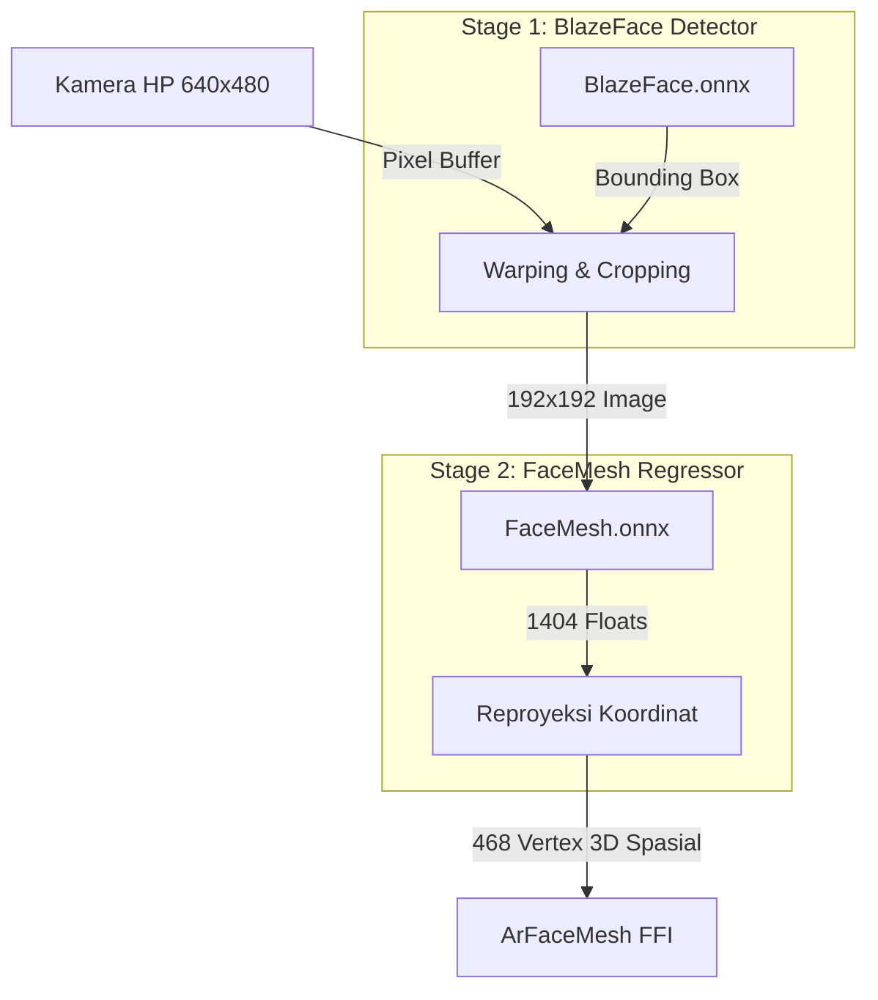

# Panduan Implementasi: Integrasi ONNX Runtime & Deteksi Wajah Native Rust (Tanpa Google ML Kit)

Dokumen ini menjelaskan status deteksi wajah saat ini, tantangan teknis untuk melepas ketergantungan dari Google ML Kit, serta formulasi matematis untuk membangun detektor wajah native Rust menggunakan **ONNX Runtime**.

---

## 1. Status Saat Ini: Mengapa Detektor Wajah Rust Masih Mock?

Saat ini, `FaceModelSession` di berkas **`src/face.rs`** masih disimulasikan (*mocked*) karena:
1.  **Pemisahan Tanggung Jawab**: Selama masa pengembangan awal, pengolahan kamera dan deteksi wajah dilakukan di sisi Android Kotlin (lewat Google ML Kit) atau iOS Swift (lewat ARKit) karena akses langsung ke API kamera sistem operasi dan akselerasi perangkat keras jauh lebih stabil.
2.  **Ukuran Biner APK**: Mengemas pustaka bersama ONNX Runtime (`libonnxruntime.so`) ke dalam APK Android menambah beban ukuran berkas sebesar **~12MB hingga 15MB** per arsitektur CPU (ARM64/ARM32).
3.  **Masalah Pipeline Dua-Tahap (Two-Stage Pipeline)**: Model Face Mesh MediaPipe tidak bisa menerima gambar mentah berukuran penuh (misal $640 \times 480$) secara langsung. Model tersebut membutuhkan koordinat wajah yang sudah dipotong rapi (*cropped*) agar fitur-fitur wajah terfokus.

---

## 2. Arsitektur Detektor Wajah Native Rust Sejati

Untuk menggantikan Google ML Kit sepenuhnya, kita harus mengimplementasikan pipeline dua-tahap di dalam Rust Core:

---

## 3. Matematika Pipeline Native Rust

Berikut adalah rincian kalkulasi matematika yang harus dikodekan ke Rust untuk menggantikan fungsi ML Kit:

### 3.1 Bilinear Image Resizing & Cropping
Setelah BlazeFace mengembalikan koordinat pembatas wajah (*bounding box*) $[x_{min}, y_{min}, w, h]$ dalam koordinat ternormalisasi $[0, 1]$:
1.  **Ekspansi Kotak**: Lebarkan kotak sebesar 25% ke segala arah agar dahi dan dagu tidak terpotong.
2.  **Interpolasi Bilinear**: Potong area tersebut dan ubah resolusinya ke $192 \times 192$ piksel. Rumus nilai piksel baru $P(x, y)$ berdasarkan 4 piksel tetangga terdekatnya di gambar asli adalah:
    $$P(x, y) = (1-dx)(1-dy)P_{00} + dx(1-dy)P_{10} + (1-dx)dyP_{01} + dx\,dyP_{11}$$
    Di mana $dx, dy$ adalah jarak fraksional piksel target ke grid asli.
3.  **Normalisasi**: Ubah nilai warna RGB $[0, 255]$ ke rentang $[-1.0, 1.0]$ sesuai input model FaceMesh:
    $$I_{norm} = \frac{I_{raw}}{127.5} - 1.0$$

### 3.2 Reproyeksi Spasial (Model Space -> Camera Space)
Output tensor FaceMesh mengembalikan 1404 koordinat float representing 468 titik 3D $(x', y', z')$ dalam koordinat ruang model $192 \times 192$.
Untuk memetakan kembali ke koordinat kamera asli (misal $W_{cam} = 640$, $H_{cam} = 480$):
$$x_{cam} = \left( x_{min} + \frac{x'}{192.0} \cdot w \right) \cdot W_{cam}$$
$$y_{cam} = \left( y_{min} + \frac{y'}{192.0} \cdot h \right) \cdot H_{cam}$$
$$z_{cam} = z' \cdot \text{scale\_factor}$$

---

## 4. Perbandingan Solusi: Google ML Kit vs Native Rust ONNX

| Parameter | Google ML Kit (Android SDK) | Native Rust ONNX Runtime |
| :--- | :--- | :--- |
| **Ukuran APK** | **Sangat Kecil (0-1 MB)** (Library diunduh otomatis oleh OS lewat Google Play Services). | **Besar (+15 MB per ABI)** (Harus menyertakan C++ library `onnxruntime` di dalam APK). |
| **Akselerasi Hardware** | **Sangat Optimal** (Menggunakan sistem akselerasi API proprietary Qualcomm/MediaTek). | **Terbatas** (Harus mengonfigurasi NNAPI Execution Provider secara manual di Rust). |
| **Kompleksitas Kode** | **Sangat Ringan** (Tinggal panggil Android API Kotlin bawaan). | **Sangat Tinggi** (Harus menulis fungsi cropping, bilinear resize, dan reproyeksi koordinat manual di Rust). |
| **Kemandirian SDK** | Terikat pada ekosistem Google (Tidak bisa jalan di Huawei tanpa GMS atau perangkat tanpa Google Play). | **100% Mandiri** (Bisa berjalan di perangkat apa pun tanpa ketergantungan Google). |

---

## 5. Kesimpulan Rekomendasi

> [!TIP]
> Untuk **GlowMatch** versi awal (*Production-Phase 1*), **sangat disarankan tetap menggunakan Google ML Kit** di sisi Android Kotlin untuk mendeteksi wajah dan mengirimkan koordinat bounding box atau mesh mentah ke Rust. Ini menjaga ukuran download aplikasi GlowMatch tetap di bawah 20MB dan memastikan performa pelacakan baterai yang optimal pada ponsel kelas menengah ke bawah.
